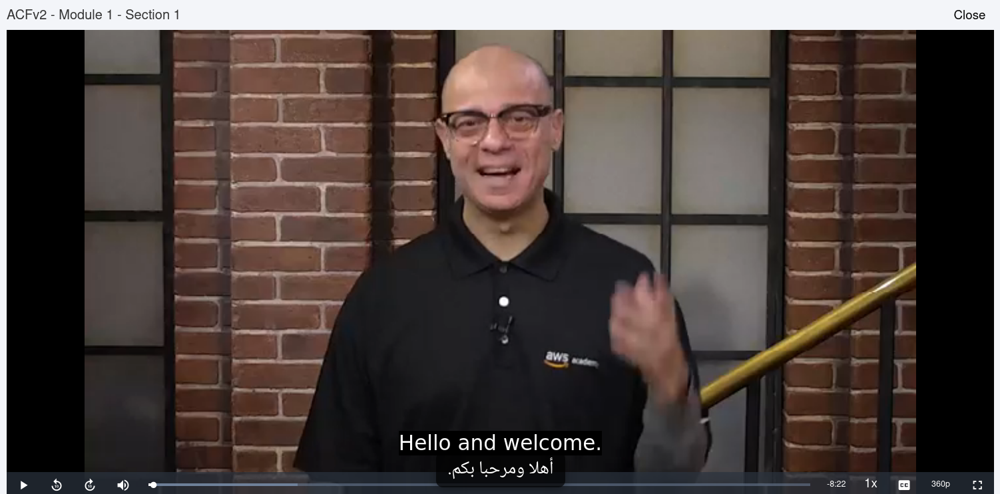

# Subtitle Translator (English → Arabic)

A free, no-API-key browser extension that captures English subtitles on any
website with HTML5 video (AWS Academy, YouTube, Vimeo, Kaltura, JW Player,
custom players, transcript panels) and overlays Arabic translations in real
time.

## Demo

## Install

### Firefox

1. Open `about:debugging`
2. Click **This Firefox**
3. Click **Load Temporary Add-on…**
4. Select `extension/manifest.json`

### Chrome / Edge / Brave / Arc

1. Open `chrome://extensions`
2. Enable **Developer mode** (top-right)
3. Click **Load unpacked**
4. Select the `extension/` folder

## How it works

- Detects `<video>` elements and known caption containers via `MutationObserver`.
- For native `<track>` cues: listens to `cuechange`.
- For DOM captions: observes text-node mutations.
- Sends English text to the background service worker, which calls Google
  Translate's free `gtx` endpoint, falling back to MyMemory on failure.
- Caches results in `chrome.storage.local` (LRU, 1000 entries) so repeated
  lines never re-translate.

## Privacy

No analytics, no tracking. Subtitle text is sent only to the chosen translation
provider over HTTPS.
